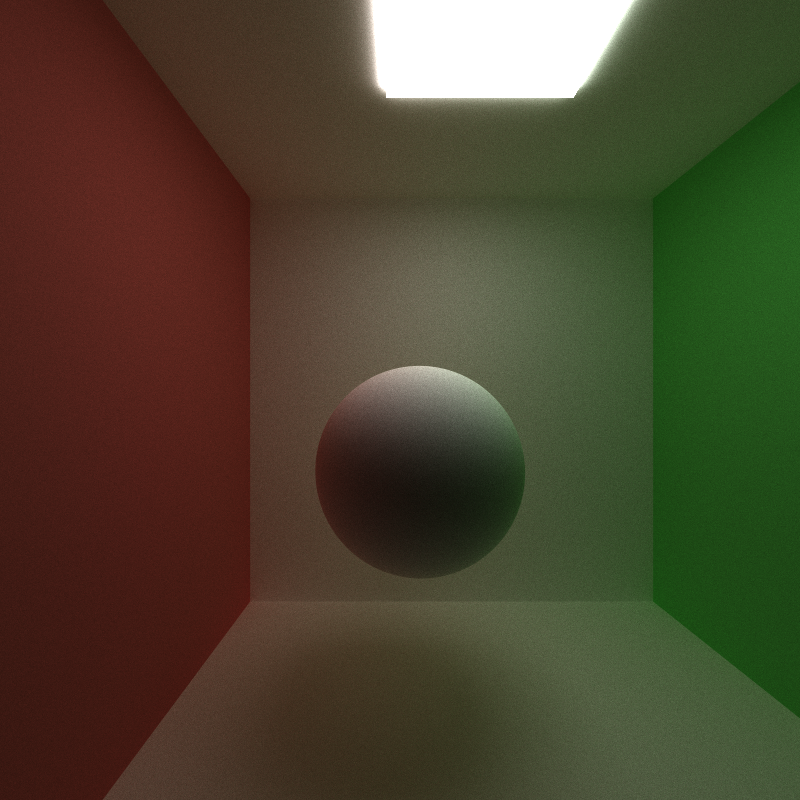
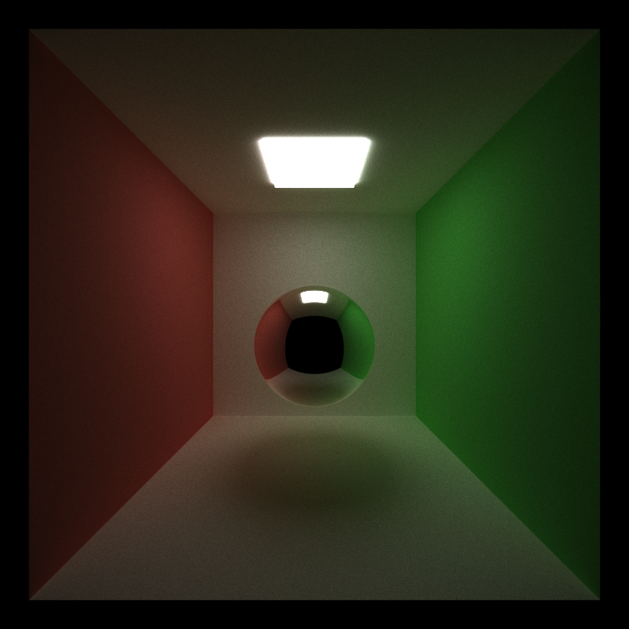
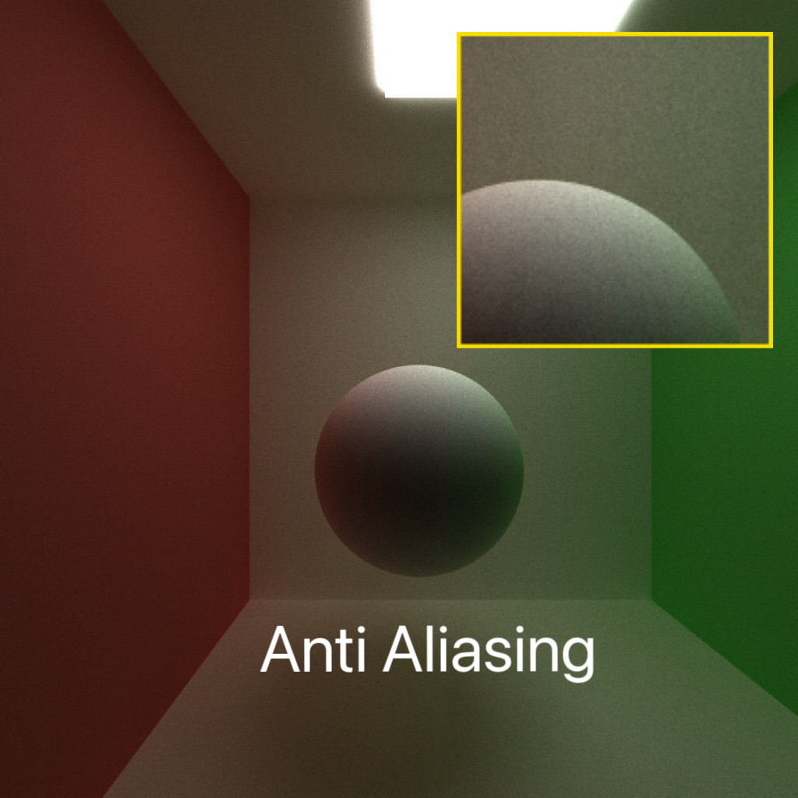
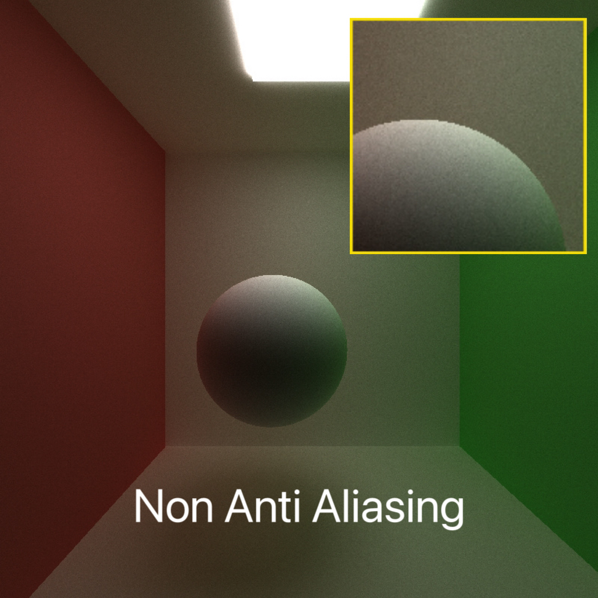
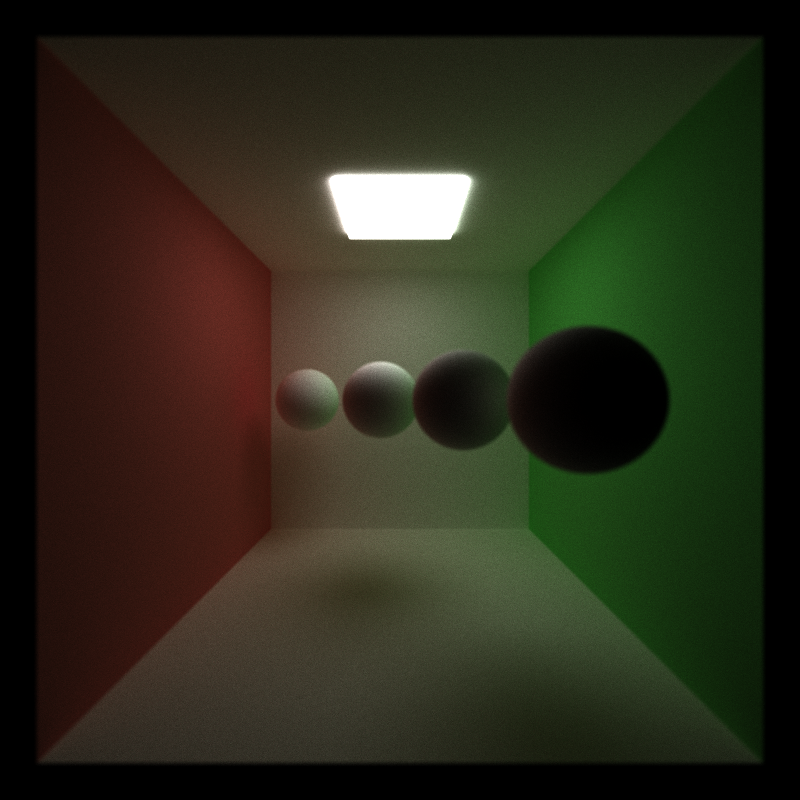
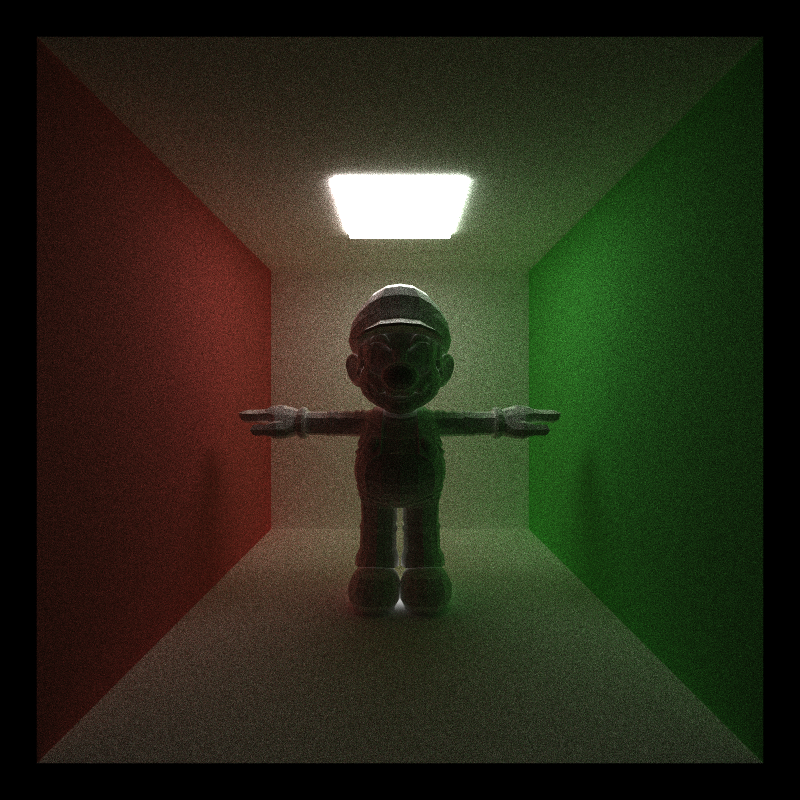
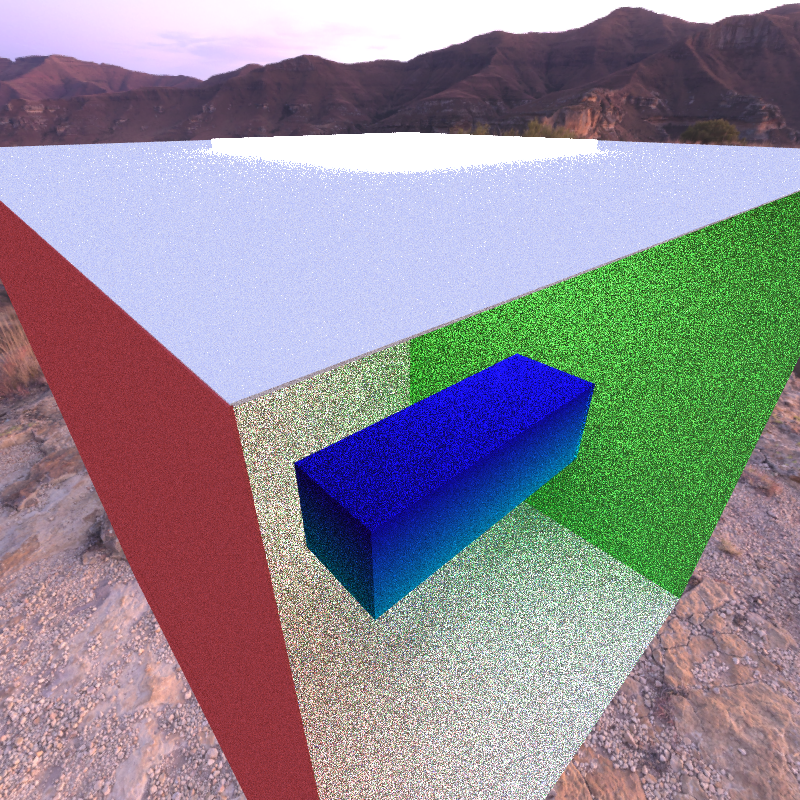

CUDA Path Tracer
================

**University of Pennsylvania, CIS 565: GPU Programming and Architecture, Project 3**

* Annie Qiu
   * [LinkedIn](https://github.com/AnnieQiuuu/Project0-Getting-Started/blob/main/www.linkedin.com/in/annie-qiu-30531921a)
* Tested on: Windows 11, i9-12900H @2500 Mhz, 16GB, RTX 3070 Ti 8GB (Personal)

## Overview
This project is a CUDA-based path tracer designed to efficiently simulate realistic lighting in 3D scenes by tracing rays and evaluating their interactions with different materials. It focuses on optimizing performance through techniques like path segment sorting and stream compaction. The path tracer also includes features such as anti-aliasing, refraction with Fresnel effects, and efficient path termination, ensuring both high visual fidelity and fast rendering times.

### Customized Scene
#### Scene: Fly me to the Saturn


### Features
- Part 1: Core features
    - A shading kernel with BSDF evaluation for
        - Ideal Diffuse
        - Perfectly specular-reflective
    - Path continuation/termination using Stream Compaction
    - Sorting by material type to get contiguous in memory
    - Antialiasing with stochastic sampled
- Part 2: More unique featrues
    -  Refraction (e.g. glass/water) with Frensel effects
    -  Physically-based depth-of-field (by jittering rays within an aperture)
    -  Arbitrary obj mesh loading and rendering 
    -  Texture mapping and bump mapping
    -  Implement Russian roulette path termination, which terminates unimportant paths early without introducing bias
- Part 3: Extra features
    - Environment Mapping

## Description Output

### Feature 1: Shading Kernel with BSDF Evaluations
The shading kernel computes light interactions at each ray-surface intersection using Bidirectional Scattering Distribution Functions (BSDF). 
#### Ideal Diffuse
Simulates surfaces that scatter light uniformly in all directions with cosine-weighted scattering.


#### Perfectly Specular
Mirror like surface, relects light perfectly based on the incident angle.


### Feature 2: Antialiasing with stochastic sampled
By jittering ray directions slightly at each pixel and averaging the results to make the image looks smoother and more natural.
#### Anti-Aliased
The boun


#### Non-Anti-Aliased


### Feature 3: Refraction
Implements refraction using Snell's Law with Fresnel effects for realistic materials like glass and water. Different Index of Refraction (IOR) values can be applied to simulate various transparent materials:
- Glass: IOR = 1.55


- Different iors results: IOR = 1.55, 1.33, 1.31, 2.42


### Feature 4: Physically-based depth of field
This feature is to simulate the real life camera lens. It produces a depth-of-field (DOF) effect, making objects outside the focus range appear blurred.
- Without dop: All objects appear in focus.


- With dop: Objects closer or farther than the focus point appear blurred, enhancing realism.


- User friendly toggable UI

- Focal Length
- Aperture

### Feature 5: Arbitrary obj mesh loading and rendering 
This feature enables the loading of complex 3D models from OBJ files to your scene. By simply adding "OBJ" in the JSON file, you can load models and assign materials to them.
- Marrio mesh with build in diffuse white material.


### Feature 6: Texture mapping and bump mapping
Supports both file-loaded textures and procedural textures. The following image shows the comparision Between with normal mapping and without normal mapping.


#### Comparasion between file-loaded textures AND a basic procedural texture
For a simple scene, a basic procedural texture may only provide a slight performance improvement. However, as the resolution and number of file-loaded textures increase, the performance benefit of using procedural textures would become more noticeable, becuase the performance overhead of file I/O and memory access becomes more significant.

- Labels 
    - meshProcedural(basic procedural texture): 23.3 FPS
    - meshTex(file loaded textures): 23.1 FPS
    - meshTexNorm(file loaded textures and bump map): 22.9 FPS
- Scene: cornellCube.json

### Feature 7: Environment Mapping
To test environment mapping, stream compaction needs to be disabled. This is because stream compaction stops rays that don't intersect any objects, which prevents them from sampling the environment map in the direction they are pointing.


| No Env | With Env |
|--------:|---------|
|  22.7   |  22.4   |

- scene: cornell.json
- Condition: #define STREAM_COMPACTION 0; #define ENVIRONMENT_MAP 1

## Description Performance

### Feature 8: Path continuation/termination using Stream Compaction
Stream compaction is an important optimization technique in path tracing. It helps to remove inactives rays from further processing. The following chart represents a 55% imrovement in performamce with stream compaction.
#### Stream Compaction Chart

- Labels
    - Original(Without Stream Compaction): 22.7 FPS
    - Stream Compaction: 35.2 FPS
- Scene: cornell.json
- Condition: #define STREAM_COMPACTION 0 & 1 (pathtrace.cu)


### Feature 9: Sorting by material type to get contiguous in memory
Sorting rays/path segments by material type ensures that all rays interacting with the same material are processed together, which reduces memory divergence and improving efficiency in the shading kernel. This is especially useful in complex scenes with multiple materials as it increase the coherency and reduces memory access. In the example chart, as we are using the a simple scene, the performances decreases after material sorting is likely, because  there's overhead of using material sorting outweighs the benefits. As the scene becomes more complex, the benefits are going to outweight the material sorting.
#### Sort material Chart

- Labels
    - Original(Without Material Sorting or Stream Compaction): 22.7 FPS
    - Stream Compaction: 35.2 FPS
    - Material Sort: 5.6 FPS
    - Material Sort with Stream Compaction: 12 FPS
- Scene: cornell.json
- Condition: #define SORTMATERIAL 0 & 1 #define STREAM_COMPACTION 0 & 1 (pathtrace.cu)

### Feature 10: Russian Roulette
This feature terminates less important rays early in the path tracing process.The following chart shows that Russian roulette terminates rays that are unlikely to contribute to the final image and reduces the computational load slightly. The close scene is slower than open scene is because rays are likely bounce more times in close scene.
#### Russian Roulette Performance evaluation

- Labels
    - close scene(Without RR in close scene): 18.9 FPS
    - open scene(Without RR in open scene): 22.7 FPS
    - closeRussian(With RR in close scene): 19.1 FPS
    - openRussian(With RR in open scene): 22.9 FPS
- Scene: cornell.json; close.json
- Condition:#define RUSSIAN_ROULETTE (pathtrace.cu)

## Bloopers
- Texture Mapping image reading issue


- BVH: Can only see the mesh through from certain angles


## Instruction
- Scenes Selection: All the scenes are stored in the scene directory. You can call the scene by setting JSON file path "../scenes/sceneName.json" in the Debugging > Command Arguments section in the Project Properties.
- Change the following define to test the features
- BVH is partially working from certain angles but doesn't work as expected.
```
#define BVH 0 // Unfinished DO NOT USE
#define ENVIRONMENT_MAP 1
#define STREAM_COMPACTION 1 // If use environment map, set to 0
#define SORTMATERIAL 1
#define RUSSIAN_ROULETTE 0
#define ANTI_ALIASING 1
```

## Reference
- BVH: https://jacco.ompf2.com/2022/04/13/how-to-build-a-bvh-part-1-basics/
- Earth: https://www.turbosquid.com/3d-models/free-max-mode-realistic-planet-earth/916040
- Rocket: https://www.turbosquid.com/3d-models/3d-toy-rocket-4k-free-1973134
- Planet: https://www.turbosquid.com/3d-models/3d-stylized-planet-system-4k-free-1973128


